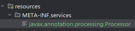
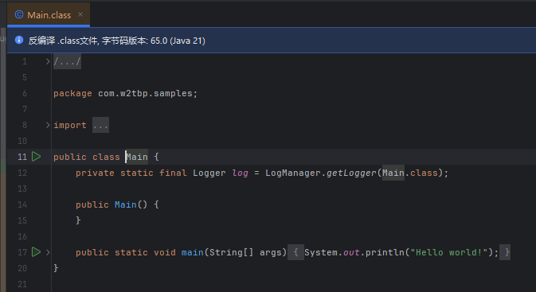
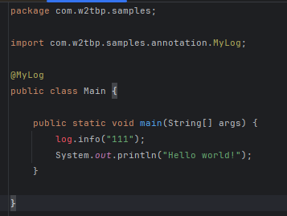
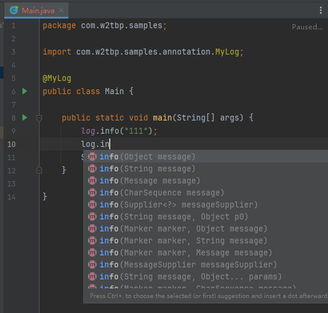
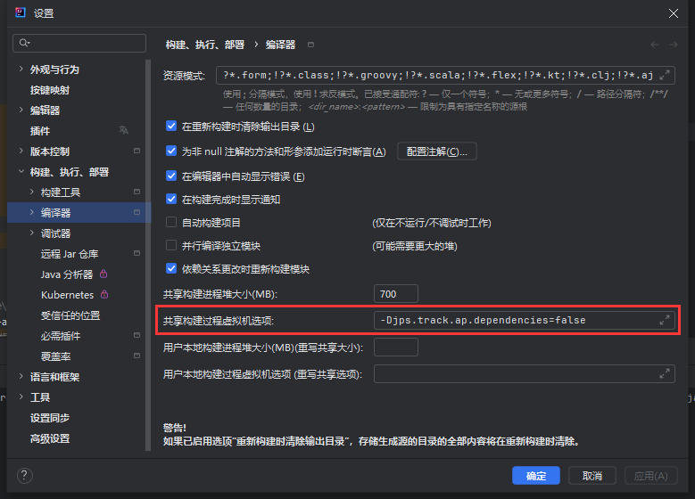

本文将通过几个方面来介绍插入式注解。包括如何搭建项目环境，如何编写注解处理器，以及编写 idea 插件使注解生成的代码不会报错。

示例代码地址
- 插入式注解代码地址：[samples/pluggable-annotation](https://github.com/w2tbp/samples/tree/main/pluggable-annotation)
- 测试代码地址：[samples/pluggable-annotation-test](https://github.com/w2tbp/samples/tree/main/pluggable-annotation-test)
- 插件的代码地址：[samples/pluggable-annotation-idea-plugin](https://github.com/w2tbp/samples/tree/main/pluggable-annotation-idea-plugin)

## 什么是插入式注解
JSR-269 插件化注解处理(Pluggable Annotation Processing API)

可以在编译期期间对代码进行处理，像经常用的 lombok 也是基于这个原理，通过注解生成 getter/setter 等方法。

javac 会通过 SPI 机制，找到要调用的注解处理器，处理完源代码后再去生成字节码。

## 搭建项目环境
在编写注解处理器时，需要通过修改语法树来达成修改代码的效果，java 提供了对应的方法，但限制了访问，得自己引入。

在 jdk8 中，可以通过引入 `java安装路径/lib/tools.jar` 来实现，而在 jdk8 以上的版本，已经不提供这个 tools.jar 了。那么在 jdk8 以上如何实现效果？就得自定义编译选项了，可以修改 maven 中编译插件的配置来达成目的。

```xml
<compilerArgs>            
	<arg>--add-exports=jdk.compiler/com.sun.tools.javac.tree=ALL-UNNAMED</arg>  
	<arg>--add-exports=jdk.compiler/com.sun.tools.javac.util=ALL-UNNAMED</arg>  
	<arg>--add-exports=jdk.compiler/com.sun.tools.javac.code=ALL-UNNAMED</arg>  
	<arg>--add-exports=jdk.compiler/com.sun.tools.javac.model=ALL-UNNAMED</arg>  
	<arg>--add-exports=jdk.compiler/com.sun.tools.javac.processing=ALL-UNNAMED</arg>  
	<arg>--add-exports=jdk.compiler/com.sun.tools.javac.api=ALL-UNNAMED</arg>  
</compilerArgs> 
```

`--add-exports` 和 `--add-opens` （lombok 用的是这个）有细微差别，我测试了下，使用 `--add-opens` 会编译报错，因为我不想纠结这个事情，于是便不求甚解了。

除此之外，还得配置一个参数：`-proc:none` 。这个是控制 javac 编译时的行为，`-proc:none` 指不使用注释处理器，只编译源文件。

maven 插件完整代码如下：

```xml
<plugin>  
    <groupId>org.apache.maven.plugins</groupId>  
    <artifactId>maven-compiler-plugin</artifactId>  
    <version>3.8.1</version>  
    <configuration>        
	    <source>${maven.compiler.source}</source>  
        <target>${maven.compiler.target}</target>  
        <compilerArgs>         
	        <arg>-proc:none</arg>   
	        <arg>--add-exports=jdk.compiler/com.sun.tools.javac.tree=ALL-UNNAMED</arg>  
            <arg>--add-exports=jdk.compiler/com.sun.tools.javac.util=ALL-UNNAMED</arg>  
            <arg>--add-exports=jdk.compiler/com.sun.tools.javac.code=ALL-UNNAMED</arg>  
            <arg>--add-exports=jdk.compiler/com.sun.tools.javac.model=ALL-UNNAMED</arg>  
            <arg>--add-exports=jdk.compiler/com.sun.tools.javac.processing=ALL-UNNAMED</arg>  
            <arg>--add-exports=jdk.compiler/com.sun.tools.javac.api=ALL-UNNAMED</arg>  
        </compilerArgs>    
	</configuration>
</plugin>
```
 
这里在顺手放一段 lombok 的配置：[lombok/docker/maven/files/jdk-21/classpath/pom.xml](https://github.com/projectlombok/lombok/blob/master/docker/maven/files/jdk-21/classpath/pom.xml)

而至于 jdk8 ，事情就简单多了，直接把 tool.jar 引入就完事了。完整代码如下：

```xml
...
<dependency>  
    <groupId>com.sun</groupId>  
    <artifactId>tools</artifactId>  
    <version>1.8</version>  
    <scope>system</scope>  
    <systemPath>${java.home}/../lib/tools.jar</systemPath>  
</dependency>
...
<plugin>  
    <groupId>org.apache.maven.plugins</groupId>  
    <artifactId>maven-compiler-plugin</artifactId>  
    <version>3.8.1</version>  
    <configuration>        
	    <source>${maven.compiler.source}</source>  
        <target>${maven.compiler.target}</target>  
        <compilerArgs>         
	        <arg>-proc:none</arg>
        </compilerArgs>    
	</configuration>
</plugin>
...
```

## 注解处理器编写
接下来进行代码的编写，既然是插入式注解，首先我们需要定义一个注解：

```java
package com.w2tbp.samples.annotation;  
  
import java.lang.annotation.ElementType;  
import java.lang.annotation.Retention;  
import java.lang.annotation.RetentionPolicy;  
import java.lang.annotation.Target;  
  
@Target({ElementType.TYPE})  
@Retention(RetentionPolicy.SOURCE)  
public @interface MyLog {  
}
```

然后编写注解处理器，得继承 AbstractProcessor 类，并重写 process 方法。在其中我们就能够调用 java 修改语法树的一系列 api，对代码进行一顿输出。

上一节费劲心思配置编译选项，把 tools.jar 引入，就是为了在编写注解处理器的时候调用这些 api。但关于修改语法树，也就是关于 JCTree 的一些语法，怎么使用，我就不多说了，因为我也不太了解 pwq，只是拿来用。

我写的这个注解处理器，是为了让代码生成一段这样的代码：

`private final static Logger logger = LogManager.getLogger(Test.class);`

完整代码如下：

```java
package com.w2tbp.samples.annotation;  
  
import com.sun.tools.javac.api.JavacTrees;  
import com.sun.tools.javac.code.Flags;  
import com.sun.tools.javac.processing.JavacProcessingEnvironment;  
import com.sun.tools.javac.tree.JCTree;  
import com.sun.tools.javac.tree.TreeMaker;  
import com.sun.tools.javac.tree.TreeTranslator;  
import com.sun.tools.javac.util.*;  
import org.apache.logging.log4j.LogManager;  
import org.apache.logging.log4j.Logger;  
  
import javax.annotation.processing.*;  
import javax.lang.model.SourceVersion;  
import javax.lang.model.element.Element;  
import javax.lang.model.element.TypeElement;  
import java.util.Set;  
  
@SupportedAnnotationTypes("com.w2tbp.samples.annotation.MyLog")  
public class MyLogProcessor extends AbstractProcessor {  
  
    private JavacTrees javacTrees;  
    private TreeMaker treeMaker;  
    private Names names;  
  
    private static final Class<MyLog> ANNOTATION_TO_PROCESS = MyLog.class;  
    private static final String LOG_CLASS_TYPE_NAME = Logger.class.getName();  
    private static final String LOG_FACTORY_CLASS_TYPE_NAME = LogManager.class.getName();  
  
    @Override  
    public synchronized void init(ProcessingEnvironment processingEnv) {  
        super.init(processingEnv);  
        this.javacTrees = JavacTrees.instance(processingEnv);  
        Context context = ((JavacProcessingEnvironment) processingEnv).getContext();  
        this.treeMaker = TreeMaker.instance(context);  
        this.names = Names.instance(context);  
    }  
  
    @Override  
    public SourceVersion getSupportedSourceVersion() {  
        return SourceVersion.latest();  
    }  
  
    @Override  
    public boolean process(Set<? extends TypeElement> annotations, RoundEnvironment roundEnv) {  
        JCTree.JCExpression varTypeName = strToJCExpression(LOG_CLASS_TYPE_NAME);  
        JCTree.JCExpression varFactoryName = strToJCExpression(LOG_FACTORY_CLASS_TYPE_NAME);  
        Name varName = names.fromString("log");  
  
        Set<? extends Element> elements = roundEnv.getElementsAnnotatedWith(ANNOTATION_TO_PROCESS);  
        for (Element element : elements) {  
            String className = element.getSimpleName().toString()+".class";  
  
            JCTree tree = javacTrees.getTree(element);  
            tree.accept(new TreeTranslator() {  
                @Override  
                public void visitClassDef(JCTree.JCClassDecl jcClassDecl) {  
                    JCTree.JCVariableDecl variableDecl = treeMaker.VarDef(  
                            treeMaker.Modifiers(Flags.PRIVATE + Flags.STATIC + Flags.FINAL),  
                            varName, varTypeName,  
                            treeMaker.Apply(  
                                    List.nil(),  
                                    treeMaker.Select(  
                                            varFactoryName,  
                                            names.fromString("getLogger")  
                                    ),  
                                    List.of(strToJCExpression(className))  
                            )  
                    );  
                    jcClassDecl.defs = jcClassDecl.defs.prepend(variableDecl);  
                    super.visitClassDef(jcClassDecl);  
                }  
            });  
        }  
        return true;  
    }  
  
    private JCTree.JCExpression strToJCExpression(String components) {  
        String[] componentArray = components.split("\\.");  
        JCTree.JCExpression expr = treeMaker.Ident(names.fromString(componentArray[0]));  
        for (int i = 1; i < componentArray.length; i++) {  
            expr = treeMaker.Select(expr, names.fromString(componentArray[i]));  
        }  
        return expr;  
    }  
  
}
```

这样基本的事情就完事了，还剩下一件事，就是这个插入式注解得通过 SPI 的方式被编译器调用，所以需要配置一下。

具体是在 `src/main/resources/META-INF/services` 目录下新建一个 `javax.annotation.processing.Processor` 文件



内容为注解处理器的路径：

```xml
com.w2tbp.samples.annotation.MyLogProcessor
```

除了这种方式，还可以用谷歌的 `auto-service` 依赖，然后在注解处理器上直接用注解 `@AutoService` 就行了。

注解处理就告一段落了，完整代码地址在：[samples/pluggable-annotation](https://github.com/w2tbp/samples/tree/main/pluggable-annotation)

## 测试
接下来测试一下。

新建一个项目，引入上面项目的依赖，简单写个测试类，编译后发现，我们想要的结果已经出现了：



测试项目代码地址在：[samples/pluggable-annotation-test](https://github.com/w2tbp/samples/tree/main/pluggable-annotation-test)

## idea 插件
现在我们知道可以生成语句，那么在代码中就可以用这个生成的对象了。但我们敲下 log 对象时，却出现了问题：



这个对象飘红了，这是正常的，因为现在并没有这个对象。但是在用 lombok 的时候显然没有这个问题，这是为什么呢？因为 lombok 在 idea 中用了插件，一些较旧的 idea 版本会让人自己装，但现在都集成了。

于是我们也来开发个自己的插件，当我们安装插件后，会看到和 lombok 一样的效果，log 也不报错了，也有代码提示了：



关于如何写插件，新建工程，怎么配置，如何实现，说起来也有点冗杂。代码基本上就是从 lombok 插件中 copy 的，ps：看它的那个插件源代码真是一件痛苦的事情。

插件的代码地址在：[samples/pluggable-annotation-idea-plugin](https://github.com/w2tbp/samples/tree/main/pluggable-annotation-idea-plugin)

可以直接下载项目目录下的 `pluggable-annotation-idea-plugin-1.0-SNAPSHOT.zip` ，然后在 idea 插件选项中，选择从磁盘中安装，安装此插件。

另需注意，IDEA 会有版本兼容问题，我这里使用的 IDEA 版本为 2024.1

## 其他
### 报错 java: java.lang.IllegalArgumentException

路径：Build, Execution, Deployment -> complier -> Shared build process VM options

加上该配置 `-Djps.track.ap.dependencies=false` 



