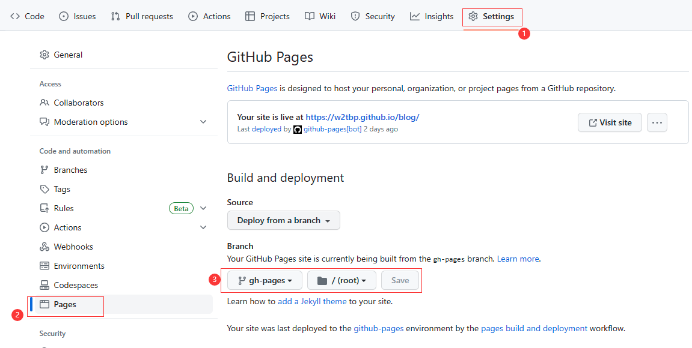
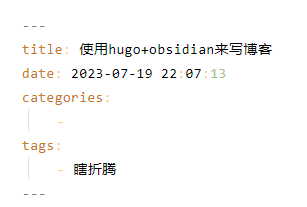

## hugo
之前用的是 hexo ，最近发现了 hugo ，感觉还行，就拿来玩玩。

一开始用下了官方的，发现还有坑，有两个版本，推荐下带 extended 后缀的那个。没有 extended 后缀的那个在跑一些主题的时候会报错。

然后去找各种主题：
[Complete List | Hugo Themes (gohugo.io)](https://themes.gohugo.io/)

都试了试，发现有个叫 stack 的还不错，搜了搜发现了作者提供的一个模版：
[CaiJimmy/hugo-theme-stack-starter](https://github.com/CaiJimmy/hugo-theme-stack-starter)
作者还写好了 Github Actions ，只需要提交就好了，so sweet。

当然 hugo 只负责生成静态页面，还需要把这些页面托管方便访问，github page 就是一个很好的选择。
因为我之前用的是 hexo ，所以是建了一个 username.github.io 的库，然后往里面推就完事了。
stack-starter 这个项目是把静态页面推到了一个 gh-pages 的分支里。

所以需要更改 github page 的设置，位于 Settings -> pages 
然后更改 Branch

当然默认模版会有很多东西想要个性化，这些就去查文档后配置吧。

## obsidian
hugo 用来生成页面，很好。
我不想用 vs code 来写东西，很痛苦，加上最近 obsidian 用的比较多，就想用 obsidian 来写文章。

但是用 obsidian 还有一些问题，好在插件生态很丰富。

### 文章头
就是这篇文章的配置，这玩意实在不想手敲。
包括那个时间戳，想想用手敲就觉得很痛苦。

当然这个东西，obsidian 就有自己的解决方案，它自有的模版系统。但是用这个有一个问题。obsidian 自带的模版，是需要选定一个文件夹的，这个文件夹里面本质上就是一堆 .md 文件，在 hugo 里面会被渲染成文章。
我也没找到如何配置 hugo 不去渲染某些文章，所以决定自己写个 obsidian 插件
[w2tbp/obsidian-post-init-plugin (github.com)](https://github.com/w2tbp/obsidian-post-init-plugin)

自定义一个命令，输入自己设定的模版。这样免去了自己手打配置的痛苦。