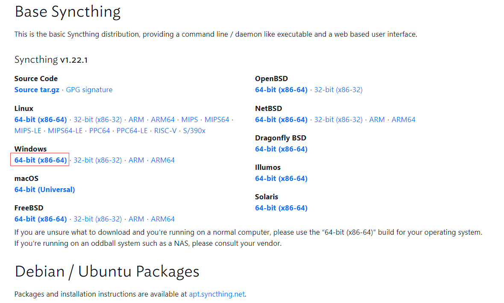

一个可以用在不同设备之间，同步文件的工具。这篇文章主要讲讲在各平台如何安装。

为了同步的稳定，需要一个24小时在线的机器，我这里使用了云服务器，如果你没有，可以去看看微力同步。

以下链接大致介绍了下怎么用：
[https://zhuanlan.zhihu.com/p/69267020](https://zhuanlan.zhihu.com/p/69267020)

## window下安装

有客户端版本的，由社区维护，我下下来试了下，没有跟到最新版本，看其他文章好像有 bug ，而且大佬也给出了其他的方案。

也就是开机自启一个 bat 文件，启动 Syncthing 提供的命令行工具。

先去官网下个包 [https://syncthing.net/downloads/](https://syncthing.net/downloads/)



然后 win + r 输入 shell:startup ，在其中新建一个 bat 文件（可以先新建个 txt 文件，输入下面内容后，再将 txt 后缀改为 bat）

需要修改三个地方

1. `D:\software\syncthing-windows-amd64-v1.22.0\syncthing.exe`

程序的目录。

2. `-config="C:\Users\admin\AppData\Local\Syncthing"`

Syncthing的配置目录。得先运行一下安装包的 syncthing.exe 才会出现，下面那个也一样

3. `-data="C:\Users\admin\AppData\Local\Syncthing\index-v0.14.0.db"`

```shell
@ECHO OFF
%1 start mshta vbscript:createobject("wscript.shell").run("""%~0"" ::",0)(window.close)&&exit
start /b D:\software\syncthing-windows-amd64-v1.22.0\syncthing.exe -config="C:\Users\admin\AppData\Local\Syncthing" -data="C:\Users\admin\AppData\Local\Syncthing\index-v0.14.0.db" -no-browser
```

程序运行后，访问 [http://127.0.0.1:8384/](http://127.0.0.1:8384/) 可以进入管理页面

参考链接

[https://blog.csdn.net/rockage/article/details/121079720](https://blog.csdn.net/rockage/article/details/121079720)

## ubuntu 下安装

同步服务，就需要一个24小时在线的服务器。我用的是腾讯云的，系统是 Ubuntu Server 20.04 LTS

```shell
# Add the release PGP keys:
sudo curl -o /usr/share/keyrings/syncthing-archive-keyring.gpg https://syncthing.net/release-key.gpg

# Add the "stable" channel to your APT sources:
echo "deb [signed-by=/usr/share/keyrings/syncthing-archive-keyring.gpg] https://apt.syncthing.net/ syncthing stable" | sudo tee /etc/apt/sources.list.d/syncthing.list

# Update and install syncthing:
sudo apt-get update
sudo apt-get install syncthing

# check version
syncthing --version
```

上面安装好了，但是会有个问题，这玩意的 webui 不能用服务器的公网 ip 访问，只能用 [http://127.0.0.1:8384/](http://127.0.0.1:8384/) 访问。应该可以用 nginx 的反向代理解决，我太菜了配置半天没成，然后发现了另外一种方法。

以下来源参考链接1

自 Ubuntu 18.04+ 开始，就可以通过创建 systemd 配置文件来管理 syncthing 服务。官方也提供了配置文件：[etc/linux-systemd](https://github.com/syncthing/syncthing/tree/master/etc/linux-systemd)

首先先创建个文件

sudo vim /etc/systemd/system/syncthing@.service

然后输入以下内容

```shell
[Unit]
Description=Syncthing - Open Source Continuous File Synchronization for %I
Documentation=man:syncthing(1)
After=network.target

[Service]
User=%i
ExecStart=/usr/bin/syncthing -no-browser -gui-address="0.0.0.0:8384" -no-restart -logflags=0
Restart=on-failure
SuccessExitStatus=3 4
RestartForceExitStatus=3 4

[Install]
WantedBy=multi-user.target
```

这样，你就能用腾讯云给的 ip 来访问了，当然防火墙得开 8384 。

注意：并且需要开 22000 端口，不然添加不了远程设备（我被坑半天）

然后可以配置一下 systemd

```shell
# 更新 systemd 服务
sudo systemctl daemon-reload

# 启动 syncthing 服务
sudo systemctl start syncthing@$USER
# 开启自启
sudo systemctl enable syncthing@$USER

# 查看服务状态
systemctl status syncthing@$USER
```

参考链接

1. [https://computingforgeeks.com/how-to-install-and-use-syncthing-on-ubuntu/](https://computingforgeeks.com/how-to-install-and-use-syncthing-on-ubuntu/)
2. [https://apt.syncthing.net/](https://apt.syncthing.net/)

## 安卓
安卓手机端同步目录提示 错误 (folder marker missing)  

这是由于该同步目录下面缺少一个 `.stfolder` 目录，解决办法是在该目录下新建文件夹: `.stfolder` (注意前面的 ".")，因为该文件夹为隐藏文件夹，有的国内定制安卓系统或者系统清理软件会自动清除该文件夹，所以如果新建 `.stfolder` 文件夹后还出现这样的情况，可以在 `.stfolder` 里随便新建一个空文件，比如我就在该文件夹下新建一个名为 `.stfolder` 的空文件。

[https://zhuanlan.zhihu.com/p/121544814](https://zhuanlan.zhihu.com/p/121544814)