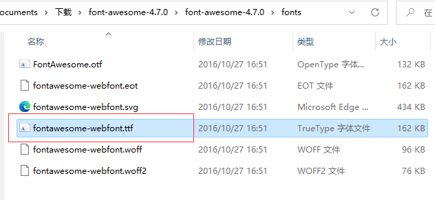
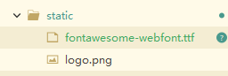
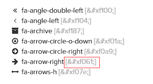
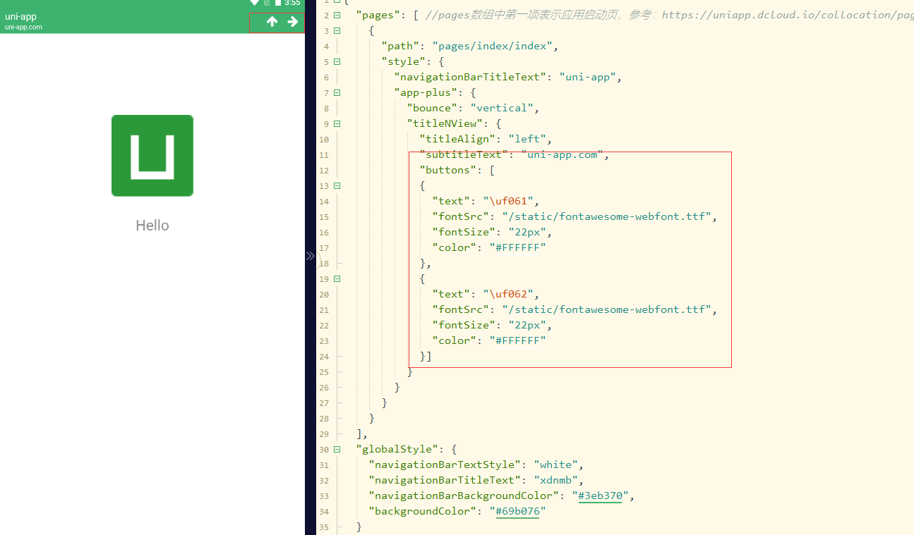
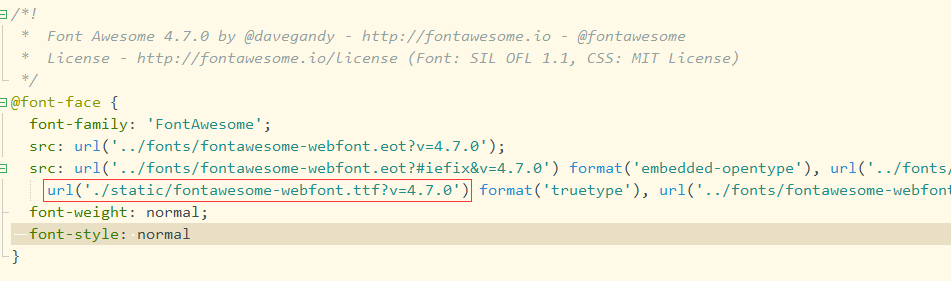
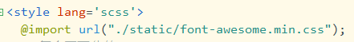
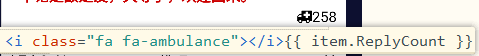

# 在导航栏中使用

uniapp 的导航栏，如果想要添加图标就得在 page.json 页面配置，因为自定义 button 只支持字体图标，所以想到了 fontawesome

[page.json - style](https://uniapp.dcloud.net.cn/collocation/pages.html#style)


首先下载 fontawesome ，去[官网](http://www.fontawesome.com.cn/) 

点击下载旧版 v4.7 ，解压后找到 `/fonts/fontawesome-webfont.ttf` ，复制粘贴到 uniapp 项目中，我这里放在了 `static` 目录下






因为 fontSrc 中只能填写 unicode ，所以需要填入图标的 unicode，这个可以在 [cheatsheet](http://www.fontawesome.com.cn/cheatsheet/) 找到



例如这个右箭头，就是 `f061` 


page.json 代码如下

```json
...
"path": "pages/index/index",
"style": {
    "navigationBarTitleText": "uni-app",
    "app-plus": {
        "bounce": "vertical",
        "titleNView": {
            "titleAlign": "left",
            "subtitleText": "uni-app.com",
            "buttons": [
                {
                    "text": "\uf061",
                    "fontSrc": "/static/fontawesome-webfont.ttf",
                    "fontSize": "22px",
                    "color": "#FFFFFF"
                },
                {
                    "text": "\uf062",
                    "fontSrc": "/static/fontawesome-webfont.ttf",
                    "fontSize": "22px",
                    "color": "#FFFFFF"
                }]
        }
    }
}
...
```


最终效果




参考链接

[Font Awesome字体图标如何使用？](https://www.cnblogs.com/xzp-blog/p/13809218.html)


# 在页面上使用

我们需要两个东西，一个是 ttf 文件，一个是 css 文件

ttf 跟上面的一样，是 `/fonts/fontawesome-webfont.ttf` 

css 是 `/css/font-awesome.min.css`

将这两个文件复制到项目中，我这里还是放在 static 目录下


好像在微信小程序中使用还得将 ttf 文件转成 Base64 ，我这边只需要关心 app ，好像也不用转。

链接 [uniapp引入 FontAwesome](https://blog.csdn.net/DemonDay01/article/details/118573876) 中有转 Base64 的方法


接下来需要修改 css 文件，替换 @font-face 里面的内容，修改为 ttf 文件在项目中的路径。




然后在 App.vue 文件中全局引入 css 文件




然后就可以使用了




参考链接

[uniapp引入 FontAwesome](https://blog.csdn.net/DemonDay01/article/details/118573876)